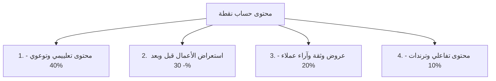

# 🎯 دليل هوية ومحتوى براند "نقطة" (Nokta)
### المنصة المتخصصة في بناء البورتفوليو والسير الذاتية الحديثة للأفراد والشركات

---

## 🎨 1. الهوية البصرية وشعارات اللوغو (Logo & Visual Identity)

تم تصميم اللوغو بالاعتماد على درجات **الأزرق السماوي (Sky Blue)** الحيوي مع **الأصفر/الليموني (Lemon Green/Yellow)** المشع لمنح شعور بالحداثة، السرعة، والاحترافية.

### مفهوم اسم "نقطة" (Nokta):
- **نقطة البداية (Starting Point):** الخطوة الأولى لكل شخص أو شركة لنقل عملهم للمستوى التالي.
- **نقطة التحول (Turning Point):** تحويل CV تقليدي ورقي إلى موقع تفاعلي جذاب.
- **دقة التفاصيل (Precision):** الاهتمام بأصغر النواحي واللمسات الفنية.

---

### 🖼️ النماذج المقترحة للشعار (Logo Designs)

#### الخيار الأول: الشعار الطباعي المبسط (Minimalist Typography Logo)

- **المميزات:** خط عربي حديث وواضح مع خط إنجليزي متناسق أسفله، مع نقطة ليمونية مشعة ترمز إلى علامة الماركة.
- **الاستخدام الأفضل:** ملفات تعريف الشركة، الهيدر في الموقع الإلكتروني، الفواتير، والتوقيعات الرقمية.

---

#### الخيار الثاني: نظام الهوية والشعار الأيقوني (Iconic Monogram & Brand System)

- **المميزات:** أيقونة دائرية تدمج حرف **N** باللغة الإنجليزية مع حرف **ن** ونقطته باللغة العربية بطريقة هندسية عصرية. مع نموذج لكروت العمل، تصميم الموقع، وتناغم الألوان.
- **الاستخدام الأفضل:** صورة بروفايل إنستغرام، أيقونة التطببيقات والتطبيقات المصغرة (Favicon)، والبوستات الرسمية.

---

### 🎨 لوحة الألوان الرسمية (Color Palette)
- 🔵 **الأزرق السماوي (Sky Blue):** `#00A3E0` أو `#38BDF8` — يرمز للثقة، التكنولوجيا، والهدوء.
- 🍋 **الأصفر الليموني (Lemon Accent):** `#BAE123` أو `#CCFF00` — يرمز للطاقة، الحداثة، والسرعة.
- 🌌 **الكحلي الداكن (Nokta Navy):** `#0F172A` — خلفية فاخرة تعكس التباين القوي وتبرز الألوان العصرية.
- ⚪ **الابيض الناصع (Pure White):** `#FFFFFF` — للنصوص وتأكيد المقروئية العالية.

---

## 📢 2. الشعارات اللفظية (Slogans)

### بالعربية (Arabic Slogans):
1. **"نقطة.. بداية انطلاقتك الاحترافية."** *(الأفضل والأشمل)*
2. **"من نقطة.. تبدأ فرصتك."** *(مختصر ومباشر)*
3. **"معرض أعمالك.. من مجرد فكرة إلى نقطة قوة."**
4. **"تصميم جذاب، أداء صاروخي، وسعر بسعر رمزي."**

### بالإنجليزي (English Slogans):
1. **"Nokta | Point to Your Success."**
2. **"Nokta | Turn Skills into Opportunities."**
3. **"Nokta | Fast, Modern, Flawless Portfolios."**

---

## 💡 3. القيمة المضافة والشريحة المستهدفة في سوريا (Value Proposition)

### ليش العميل السوري (فرد أو شركة) هيختار "نقطة"؟
1. **السعر الرمزي المناسب (Affordable Pricing):** باقات تناسب الشباب والشركات الناشئة في سوريا بدلاً من تكاليف التطوير الباهظة.
2. **السرعة القياسية في التسليم (24-48 ساعة):** إنجاز البورتفوليو أو الـ CV التفاعلي بوقت سريع جداً.
3. **تصاميم جذابة وأداء صاروخي (Modern & Ultra Fast):** موقع سريع جداً يفتح بسرعة حتى مع سرعات الإنترنت الضعيفة، مع توافق تام مع الموبايل.
4. **دعم العمل الحر (Remote Work & Freelancing):** مساعدة الخريجين والمستقلين السوريين للوصول لعملاء خارج سوريا عبر بورتفوليو احترافي يُعرض بالدولار أو باللغة الإنجليزية.

---

## 📱 4. خطة إنستغرام الشاملة (Instagram Growth & Content Plan)

### 📌 أ. تهيئة البروفايل (Profile Setup Checklist)
- **اسم الحساب (Name Field):** نقطة | بورتفوليو وسيرة ذاتية حديثة 🚀
- **اليوزر (Username):** `@nokta.sy` أو `@nokta.design` أو `@nokta.portfolio`
- **البايو (Bio):**
  > 🎯 نساعد الأفراد والشركات في إبراز أعمالهم بمواقع احترافية وسريعة.
  > ⚡ تسليم خلال 48 ساعة | تصاميم عصرية | أسعار رمزية.
  > ⬇️ احجز معرض أعمالك الآن واستلم معقايينك مجاناً:
  > [رابط الواتساب / رابط الموقع]
- **الهايلايتس (Highlights):**
  1. 🌟 **أعمالنا (Portfolio)** — صور وفيديوهات قصيرة من نماذج المواقع والـ CVs.
  2. 💰 **الأسعار (Prices)** — شرح الباقات الرمزية بوضوح وشفافية.
  3. 💬 **آراء العملاء (Reviews)** — ريفيوهات وتقييمات العملاء.
  4. ❓ **أسئلة شائعة (FAQ)** — كيف يتم التسليم؟ طرق الدفع المتاحة في سوريا؟ السرعة؟

---

### 🧱 ب. محاور المحتوى (Content Pillars)

1. **محتوى توعوي/تعليمي (40%):** لماذا البورتفوليو يرفع دخلك؟ الفرق بين CV ورقي وموقع شخصي؟ كيف تقنع الشركة بتوظيفك؟
2. **استعراض نماذج وأعمال (30%):** شو شو كيس قبل وبعد، استعراض الميزات، التجاوب مع الموبايل.
3. **عروض وباقات وسعر رمزي (20%):** خصومات، باقات خريجين، باقات شركات.
4. **تفاعلي وترندات (10%):** أسئلة، استفتائات، مواقف طريفة مع مقابلات العمل.

---

### 📝 ج. 10 أفكار منشورات جاهزة (Ready-to-Post Carousel & Reels Ideas)

#### 1️⃣ منشور (Carousel): ليش الـ CV الورقي (PDF) ما بقى يكفي في 2026؟
- **السلايد 1 (الغلاف):** 80% من الشركات بتتجاهل الـ CV التقليدي! شو السبب؟ (تصميم بالأزرق والليموني).
- **السلايد 2:** الـ PDF بيتنسى بين آلاف الملفات.. بينما الموقع الشخصي يترك انطباع لا يُنسى.
- **السلايد 3:** الموقع الشخصي بيعرض مشاريعك التفاعلية، أرقامك، وفيديوهاتك بشكل مباشر.
- **السلايد 4:** سهولة التحديث: بضغط زر بتعدل مهاراتك بدون ما ترجع تبعث ملف جديد.
- **السلايد 5 (CTA):** احصل على بورتفوليو تفاعلي مذهل بأسعار رمزية وسرعة فائقة من **نقطة**. علّق بـ "نقطة" ليصلك العرض بالخاص!

#### 2️⃣ فيديو (Reels): كيف البورتفوليو بيخلي المستقل (Freelance) يرفع سعره 3 أضعاف؟
- **الفكرة:** المشهد الأول شخص يرسل رابط Google Drive ملخبط لعميل خارجي والعميل يرفض، المشهد الثاني يرسل رابط موقع أنيق من **نقطة** والعميل يوافق فوراً.
- **الكابشن:** الانطباع الأول هو كل شيء! موقعك الشخصي هو مكتبك الرقمي أمام العملاء.

#### 3️⃣ منشور (Carousel): للشركات والشركات الناشئة: ليش شركتك محتاجة Profile موقع إلكتروني مش صفحة فيسبوك بس؟
- **الغلاف:** هل صفحة الفايسبوك تكفي لبناء براند قوي لشركتك؟
- **النقاط:** المصداقية أمام المستثمرين والعملاء، محركات البحث (SEO)، تنظيم الخدمات والأعمال، احترافية وسائل التواصل.

#### 4️⃣ منشور (Infographic): مقارنة حاسمة: CV عادي vs موقع بورتفوليو من "نقطة"
- مقارنة جدول سريع بين السعر، السرعة، الشكل، والتأثير.

#### 5️⃣ فيديو قصص نجاح (Reels): من خريج جديد إلى موظف بشركة عربية بفضل البورتفوليو!
- عرض قصة نجاح عميل استفاد من بورتفوليو سرّع توظيفه.

#### 6️⃣ منشور (Carousel): 5 أخطاء قاتلة بتخرب البورتفوليو تبعك (تجنبها فوراً!)
- البطء في التحميل، عدم التوافق مع الموبايل، التصميم المعقد، غياب أزرار التواصل السريعة.

#### 7️⃣ فيديو سريع (Reels Showcase): استعراض بورتفوليو لمبرمج / مصمم / طبيب / شركة خلال 15 ثانية
- تصوير شاشة سريع لموقع تم إنجازه بـ 24 ساعة مع موسيقى حماسية وترند.

#### 8️⃣ منشور (Carousel): شو لازم يتضمن بورتفوليو الشركات في سوريا؟
- قسم من نحن، الخدمات، معرض الأعمال الأبرز، آراء العملاء، فورمة التواصل السريعة عبر واتساب.

#### 9️⃣ منشور عروض (Promo Post): باقة الخريجين الجدد والشركات الناشئة بسعر رمزي جداً!
- عرض لفترة محدودة: موقع بورتفوليو سريع + CV تفاعلي + ربط واتساب بسعر رمزي.

#### 🔟 منشور تفاعلي (Interactive Game): قيّم بورتفوليوك الحالي من 10!
- اسأل المتابعين في التعليقات يرسلوا روابط أعمالهم أو ملفاتهم لتقييمها مجاناً في الستوري.

---

## 📈 5. استراتيجية زيادة المتابعين والتفاعل (Growth & Interactive Hacks)

1. **خطة الأتمتة المباشرة (DM Automation Hack):**
   - اكتب في نهاية كل بوست: *"علّق كلمة **[نقطة]** أو **[CV]** وسيرسل لك البوت باقاتنا الرمزية ونماذج أعمالنا فوراً في الخاص"*. هذا يزيد تعليقات البوست 500% ويرفع وصول البوست في الخوارزميات.

2. **التسويق عبر مجتمعات الطلاب والمستقلين في سوريا:**
   - النشر في مجموعات الجامعات، مجتمعات البرمجة والتصميم في سوريا، وجروبات التوظيف، مع تقديم فحص مجاني لـ CV المتابعين في الستوري.

3. **سلسلة ستوريات يومية تفاعلية (Daily Story Formula):**
   - **الصباح:** استبيان (Poll) — هل عندك بورتفوليو جاهز حالياً؟ (نعم / لا).
   - **الظهر:** نقد وتحليل CV/بورتفوليو أحد المتابعين بطريقة محترفة وبناءة.
   - **المساء:** كواليس تصميم موقع جديد لعميل في نقطة + العرض الرمزي اليومي.

4. **الجدول الزمني للنشر (Posting Schedule):**
   - **Reels (فيديوهات قصيرة):** 3-4 مرات أسبوعياً (أوقات الذروة في سوريا: 7 مساءً - 10 مساءً).
   - **Carousels (منشورات شرائح):** 3 مرات أسبوعياً.
   - **Stories (القصص):** من 4 إلى 8 ستوريات يومياً لتفعيل التفاعل المستمر.

---
*تم إعداد هذا الملف كمرجع كامل لهوية ومحتوى **نقطة (Nokta)**.*
